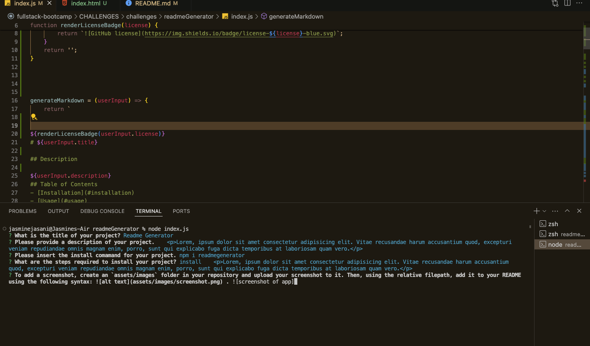

  

# README GENERATOR

## Description

Lorem ipsum dolor sit amet, consectetur adipiscing elit. Proin a dignissim tellus, quis suscipit purus. Vivamus sem sem, feugiat ut ligula a, laoreet accumsan diam. Donec elementum felis non varius semper. Etiam gravida odio metus, et commodo justo porta quis. Maecenas nibh felis, viverra nec interdum eget, laoreet non tellus. In efficitur quam ligula, ut mattis tortor iaculis sit amet. Donec fringilla faucibus nulla, eu condimentum quam commodo et. Sed at justo eget enim ultricies fringilla. Nunc at metus nisl. Vestibulum suscipit fermentum enim id efficitur. Maecenas eget tortor eu nunc cursus porttitor. 

## Table of Contents
- [Installation](#installation)
- [Visuals](#visuals)
- [Usage](#usage)
- [License](#license)
- [Contributing](#contributing)
- [Tests](#tests)
- [Questions](#questions)

## Install Command

 > npm install readmegen

## Installation
Lorem ipsum dolor sit amet, consectetur adipiscing elit. Proin a dignissim tellus, quis suscipit purus. Vivamus sem sem, feugiat ut ligula a, laoreet accumsan diam. Donec elementum felis non varius semper. Etiam gravida odio metus, et commodo justo porta quis. Maecenas nibh felis, viverra nec interdum eget, laoreet non tellus. In efficitur quam ligula, ut mattis tortor iaculis sit amet. Donec fringilla faucibus nulla, eu condimentum quam commodo et. Sed at justo eget enim ultricies fringilla. Nunc at metus nisl. Vestibulum suscipit fermentum enim id efficitur. Maecenas eget tortor eu nunc cursus porttitor. 

## Visuals

## Usage
Lorem ipsum dolor sit amet, consectetur adipiscing elit. Proin a dignissim tellus, quis suscipit purus. Vivamus sem sem, feugiat ut ligula a, laoreet accumsan diam. Donec elementum felis non varius semper. Etiam gravida odio metus, et commodo justo porta quis. Maecenas nibh felis, viverra nec interdum eget, laoreet non tellus. In efficitur quam ligula, ut mattis tortor iaculis sit amet. Donec fringilla faucibus nulla, eu condimentum quam commodo et. Sed at justo eget enim ultricies fringilla. Nunc at metus nisl. Vestibulum suscipit fermentum enim id efficitur. Maecenas eget tortor eu nunc cursus porttitor. 

## License
This project is licensed by:

## Contributing
Lorem ipsum dolor sit amet, consectetur adipiscing elit. Proin a dignissim tellus, quis suscipit purus. Vivamus sem sem, feugiat ut ligula a, laoreet accumsan diam. Donec elementum felis non varius semper. Etiam gravida odio metus, et commodo justo porta quis. Maecenas nibh felis, viverra nec interdum eget, laoreet non tellus. In efficitur quam ligula, ut mattis tortor iaculis sit amet. Donec fringilla faucibus nulla, eu condimentum quam commodo et. Sed at justo eget enim ultricies fringilla. Nunc at metus nisl. Vestibulum suscipit fermentum enim id efficitur. Maecenas eget tortor eu nunc cursus porttitor. 

## Tests
Lorem ipsum dolor sit amet, consectetur adipiscing elit. Proin a dignissim tellus, quis suscipit purus. Vivamus sem sem, feugiat ut ligula a, laoreet accumsan diam. Donec elementum felis non varius semper. Etiam gravida odio metus, et commodo justo porta quis. Maecenas nibh felis, viverra nec interdum eget, laoreet non tellus. In efficitur quam ligula, ut mattis tortor iaculis sit amet. Donec fringilla faucibus nulla, eu condimentum quam commodo et. Sed at justo eget enim ultricies fringilla. Nunc at metus nisl. Vestibulum suscipit fermentum enim id efficitur. Maecenas eget tortor eu nunc cursus porttitor. 

## Questions
If you have any questions, you may reach me through the following:

Email: jasmine@gmail.com

Github: [J-0987](https://github.com/J-0987/readmeGenerator)

