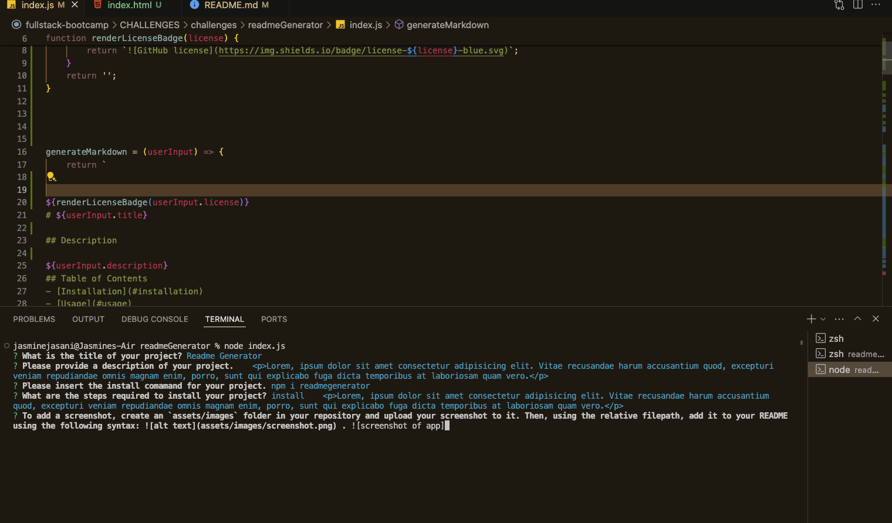

# ReadMe Generator

This is a command-line interface (CLI) tool that generates README files for your projects. It's powered by Node.js and utilizes the Inquirer module to interactively prompt users for project information, allowing them to easily create well-structured README files.

## Table of Contents
- [Features](#features)
- [Installation](#installation)
- [Usage](#usage)
- [Visuals](#visuals)
- [License](#license)
- [Contributing](#contributing)
- [Tests](#tests)
- [Questions](#questions)

## Features

- Interactive CLI interface powered by Inquirer
- Generates README files with predefined sections for easy documentation
- Allows customization of README content based on user input
- Supports markdown formatting for better readability

## Installation
To use this README generator, you need to have Node.js installed on your system. Follow these steps to get started:

Clone this repository to your local machine:

    git clone git@github.com:J-0987/readmeGenerator.git

Navigate to the project directory:

    cd readme-generator

Install dependencies using npm:

    npm install

## Usage

To generate a README file for your project, run the following command:

    node index.js

Follow the prompts to provide information about your project. Once you've completed all the prompts, the README file will be generated in the current directory.

## Visuals

Here is a short video that runs you through the entire process from installation to completion:

Screenshot of the application with prompts and user answers:

## Contributing

Contributions are welcome! If you have any ideas for improvements or new features, feel free to open an issue or submit a pull request.
My git hub is [Jasmine](https://www.markdownguide.org/basic-syntax/)

## License

This project is licensed under the MIT License.

## Acknowledgements

This project was inspired by the need for easy README file generation for various projects.
Special thanks to the Inquirer module for providing a simple and intuitive CLI interface.
